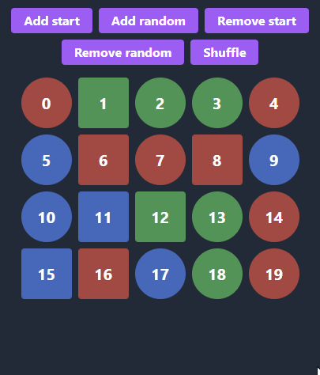

# `<AnimatedFor />` component for [Leptos](https://leptos.dev/)

[FLIP](https://aerotwist.com/blog/flip-your-animations/) animations for element and component groups inspired by Vue's [`<TransitionGroup>`](https://vuejs.org/guide/built-ins/transition-group.html).

<p align="center">
    
</p>

This crate exports a component similar to Leptos' built-in [`<For />`](https://docs.rs/leptos/latest/leptos/fn.For.html) with additional properties for applying specific CSS classes to nodes that:

- are rendered for the first time

- represent already removed items

- have their positions changed due to reorder or other elements being added / removed.

## Usage

```rs
view! {
    <AnimatedFor
        each=items
        key=|item| item.id
        children=|item| item.view
        enter_from_class="before-enter-animation"
        enter_class="enter-animation"
        move_class="move-animation"
        leave_class="leave-animation"
        appear=true
    />
}
```

- `enter_from_class` - class applied to each new element for a single tick. Then the class is removed and `enter_class` is inserted instead. This is useful for defining the initial state of an element (e.g. full transparency) before the enter animation starts.

- `enter_class` - appended to entering elements. The class is removed on a [transitionend](https://developer.mozilla.org/en-US/docs/Web/API/Element/transitionend_event) or [animationend](https://developer.mozilla.org/en-US/docs/Web/API/Element/animationend_event) event, or if move transition is triggered before this one ends.

- `move_class` - active class for elements moving to their new positions. The class is removed on a `transitionend` or `animationend` event (same as `enter_class`). Reordering items again before they reach their destinations will stagger the animation and overwrite the target positions.

- `leave_class` - removed items have their elements present in the DOM with this class applied. The nodes are removed on a `transitionend` or `animationend` event.

- `appear` - if true, the enter transition triggers for all children on initial `<AnimatedFor />` render.

Example usage with [TailwindCSS](https://tailwindcss.com/):

```rs
view! {
     <AnimatedFor
        each=items
        key=|item| item.id
        children=|item| item.view
        enter_from_class="opacity-0"
        enter_class="duration-800"
        move_class="duration-1200"
        leave_class="opacity-0 duration-500"
        appear=true
    />
}
```

Check out `examples` directory for a complete code.

## Known issues

- Given a child element with always present `transition` or `transition-duration` style property, move transition breaks if triggered before the previous move transition has finished.\
  Unless the children are reordered frequently, this should not be a problem.\
  To prevent the glitch from occurring, make sure that the transition-related properties are applied only via `enter_class`, `move_class`, or `leave_class` props. In case you need the transitions for e.g. hover animations, you can wrap the elements in additional `<div>` nodes, so `<AnimatedFor />` can work on them instead.\
  As of writing this, I'm not sure how to fix this, but I will investigate this in the future.

- Elements rendered on server-side have no `enter_from_class` applied initially. In combination with `appear` prop, the nodes may be visible for a short time before the enter animation starts.\
  If you care about the initial entering transition, make sure that the list is rendered in the browser.

## TODO

- [ ] tests
- [ ] investigate the known issues
- [ ] optional properties for explicit animation duration
- [ ] optional bool prop for assigning a static `z-index` to each child, so triggering a move transition before the previous one has finished doesn't cause overlapping elements to be chaotically moved from front to back and vice versa.

## License

[MIT License](https://opensource.org/licenses/MIT)

Copyright (c) 2023-PRESENT Kajetan Welc

Permission is hereby granted, free of charge, to any person obtaining a copy of this software and associated documentation files (the "Software"), to deal in the Software without restriction, including without limitation the rights to use, copy, modify, merge, publish, distribute, sublicense, and/or sell copies of the Software, and to permit persons to whom the Software is furnished to do so, subject to the following conditions:

The above copyright notice and this permission notice shall be included in all copies or substantial portions of the Software.

THE SOFTWARE IS PROVIDED "AS IS", WITHOUT WARRANTY OF ANY KIND, EXPRESS OR IMPLIED, INCLUDING BUT NOT LIMITED TO THE WARRANTIES OF MERCHANTABILITY, FITNESS FOR A PARTICULAR PURPOSE AND NONINFRINGEMENT. IN NO EVENT SHALL THE AUTHORS OR COPYRIGHT HOLDERS BE LIABLE FOR ANY CLAIM, DAMAGES OR OTHER LIABILITY, WHETHER IN AN ACTION OF CONTRACT, TORT OR OTHERWISE, ARISING FROM, OUT OF OR IN CONNECTION WITH THE SOFTWARE OR THE USE OR OTHER DEALINGS IN THE SOFTWARE.
